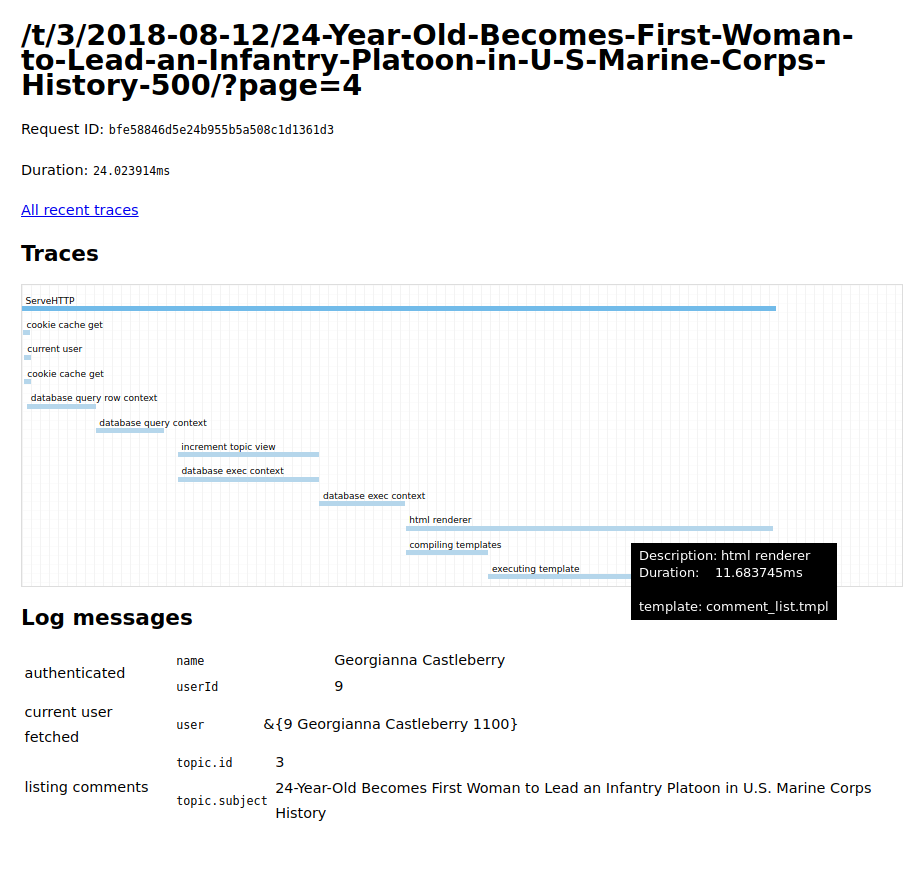
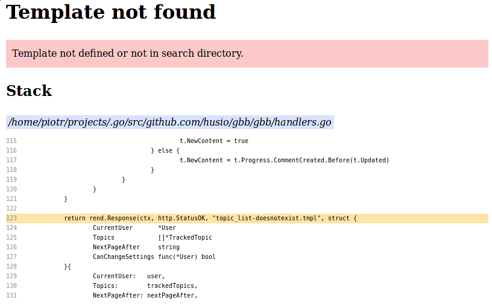

# `surf`

"Batteries included" web development package. No external dependencies.


- [`surf`](#-surf-)
  * [Router](#router)
    + [Handlers](#handlers)
    + [Middlewares](#middlewares)
  * [Logging](#logging)
  * [Traces](#traces)
  * [Debug Toolbar](#debug-toolbar)
  * [HTML Template](#html-template)
  * [Cache](#cache)
  * [CSRF](#csrf)
  * [SQL](#sql)


## Router

When defining a [route](https://godoc.org/github.com/go-surf/surf#Route) in `surf`, you must explicitly declare which methods are handled.

```go
rt := surf.NewRouter()
rt.R(`/users/(user-id:\d+)`).
    Get(handleUserDetails).
    Post(handleUserUpdate)
```

Path declarations use regular expressions to match the URL's path. Above path is translated to `^/users/\d+$`. Parentheses and pattern name (`user-id`) are a syntactic sugar to make declarations look nicer. Use [`surf.PathArg`](https://godoc.org/github.com/go-surf/surf#PathArg) to access the matched value inside of a handler.

Not found or method not allowed errors are rendered using `surf/render_error.tmpl`. A default template is provided by `surf`, but can be overwritten to customize error messages.

### Handlers

Provided handler can use different notation (see [`AsHandler`](https://godoc.org/github.com/go-surf/surf#AsHandler) for more details).

When writing [escape early if statements](https://softwareengineering.stackexchange.com/questions/18454/should-i-return-from-a-function-early-or-use-an-if-statement), because of default `http.Handler` notation, you may forget to `return` and only later realize the mistake. To help with this issue, `surf` supports [`surf.HandlerFunc`](https://godoc.org/github.com/go-surf/surf#HandlerFunc) notation, that returns a [`surf.Response`](https://godoc.org/github.com/go-surf/surf#Response).

If you want to directly write a response to `http.ResponseWriter` instead of returning a `surf.Response` instance, return `nil`.


### Middlewares

Any route can provide [middlewares](https://godoc.org/github.com/go-surf/surf#Middleware) to all its handlers:

```go
rt.R(`/users/(user-id:\d+)`).
    Use(myMiddleware).
    Get(handleUserDetails).
    Use(surf.CsrfMiddleware(cache, tmpl).
    Post(handleUserUpdate)
```

`myMiddlware` is called for both handlers, while `surf.CsrfMiddleware` is used only for the `POST` method.

## Logging

Logging is done using one of two logging functions. Use [`LogInfo`](https://godoc.org/github.com/go-surf/surf#LogInfo) or [`LogError`](https://godoc.org/github.com/go-surf/surf#LogError) to write error logs.

Remember to use [`surf.LoggingMiddleware`](https://godoc.org/github.com/go-surf/surf#LoggingMiddleware).  It attaches a logger instance to each request's context, providing additional request information.

A log entry must contain a message and can have any number of additional key-value parameters. To ensure explicit formatting, each key-value pair must be a string.

```go
surf.LogInfo(ctx, "Playing surfin' USA",
     "author", "Blind Guardian",
     "luckyNumber", fmt.Sprint(myLuckyNumber))
```


## Traces

To get better insight into a running application, create traces. `surf` does not use [open tracing](http://opentracing.io/), but provides similar functionality.

Use [`TracingMiddleware`](https://godoc.org/github.com/go-surf/surf#TracingMiddleware) together with [`CurrentTrace`](https://godoc.org/github.com/go-surf/surf#CurrentTrace) to measure code performance.

Traces are sampled and gathered for only some requests to avoid performance degradation due to measuring.

Best practice is to provide a wrapper for your services ([database](https://github.com/go-surf/surf/blob/master/sqldb/sql_trace.go), [cache](https://godoc.org/github.com/go-surf/surf#TraceCache), RPC client) that transparently create traces for the user.

## Debug Toolbar

*Debug toolbar must be used only during local development*. It displays useful information about handled requests on a single page.



## HTML Template

`surf` provides an [`HTML Renderer`](https://godoc.org/github.com/go-surf/surf#NewHTMLRenderer) for rendering HTML documents. It is using the `html/template` package to render.

When in debug mode, all rendering failures return friendly error pages.




`surf` comes with many default HTML templates predefined, for example for standard HTTP error pages, but they can be overwritten by the
application.


## Cache

Many cache implementations, depending on the use case.


## CSRF

Yes.


## SQL

Yes.
